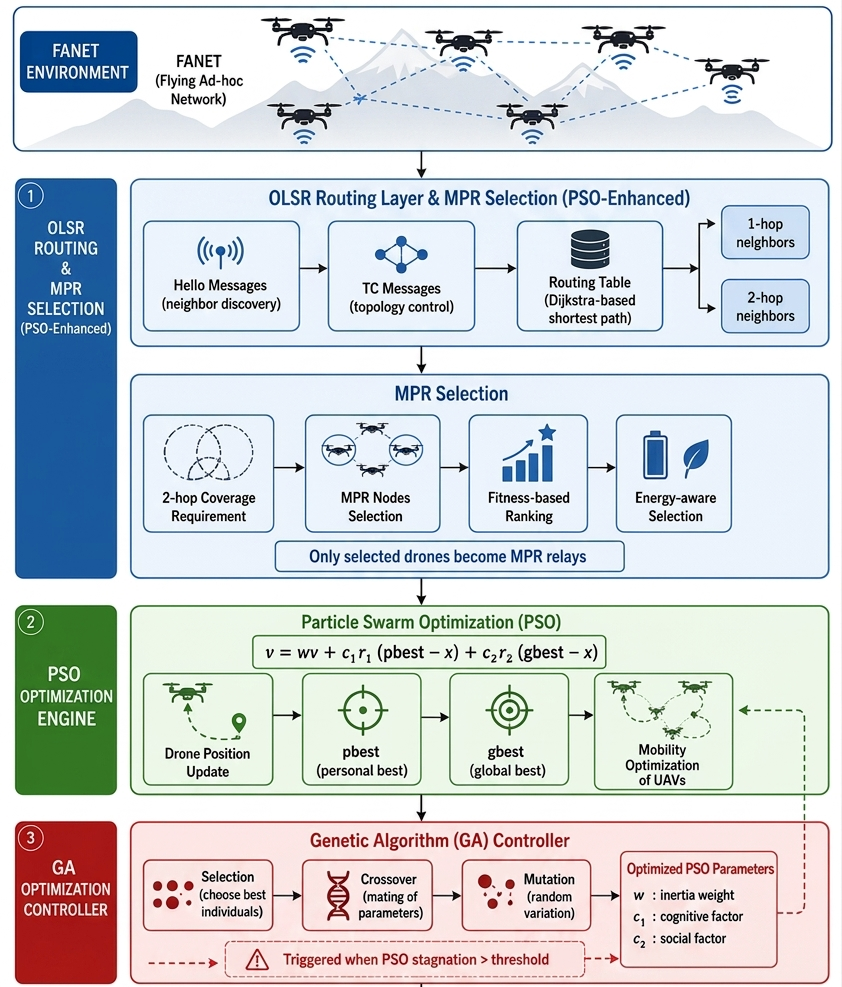

# Enhancing FANET Communication Reliability Using OLSR-PSO-GA Optimization

**Optimized OLSR MPR selection using Particle Swarm Optimization and Genetic Algorithms for reliable UAV networks.**

---

##  Overview

Flying Ad Hoc Networks (FANETs) are characterized by high node mobility,
frequent topology changes and unstable wireless links. Under these conditions,
the standard **OLSR** protocol may select Multipoint Relays (MPRs) that are
not reliable enough, which degrades communication quality.

This research project proposes an **optimized MPR selection mechanism** that
combines **Particle Swarm Optimization (PSO)** and a **Genetic Algorithm (GA)**
to improve the reliability of UAV communications, while preserving the
fundamental principles of the OLSR protocol.

##  Objectives

- Improve communication reliability in dynamic UAV networks
- Optimize MPR selection using a hybrid PSO-GA approach
- Reduce packet loss and end-to-end delay
- Maintain compatibility with the OLSR protocol architecture
- Evaluate performance through realistic ns-3 simulations

##  System Architecture

*Figure 1: Overall architecture of the proposed OLSR-PSO-GA approach.*

## 🛠️ Technologies

| Category | Tools |
|----------|-------|
| Simulator | ns-3 |
| Language | C++ |
| Routing protocol | OLSR |
| Optimization | Particle Swarm Optimization (PSO), Genetic Algorithm (GA) |
| Application domain | FANET / UAV networks |

##  Evaluation Metrics

- Packet Delivery Ratio (PDR)
- End-to-End Delay
- Throughput
- Jitter

##  Results

| Metric | 10 UAVs | 30 UAVs | 50 UAVs |
|--------|--------:|--------:|--------:|
| PDR (%) | 85.81 | 90.72 | 90.34 |
| Throughput (Kbps) | 15.55 | 87.87 | 174.96 |
| End-to-End Delay (ms) | 26.90 | 20.14 | 26.64 |
| Jitter (ms) | 17.75 | 16.69 | 21.25 |

